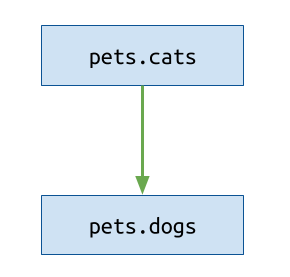
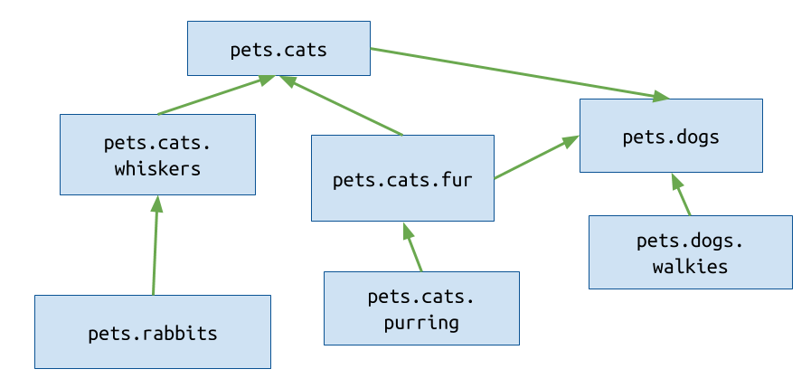
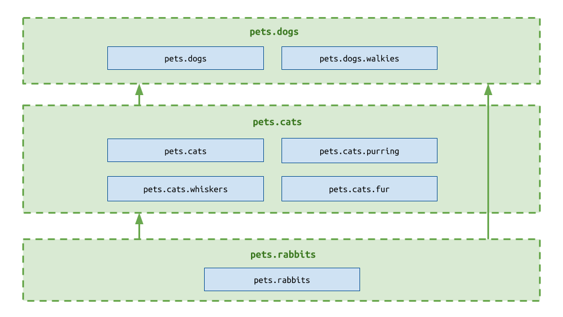
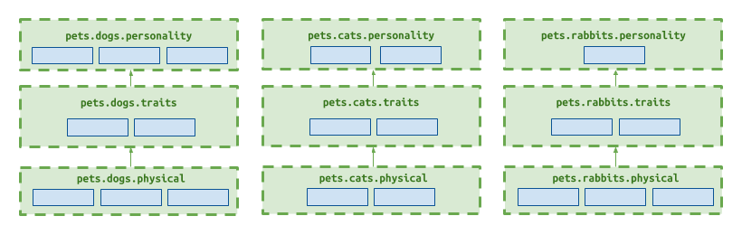

=============
Core concepts
=============

The Dependency Graph
--------------------

At the heart of Layer Linter is a graph of internal dependencies within
a Python code base. This is a `graph in a mathematical sense`_: a collection
of items with relationships between them. In this case, the items are
Python modules, and the relationships are imports between them.

.. _graph in a mathematical sense: https://en.wikipedia.org/wiki/Graph_(discrete_mathematics)

For example, a project named ``pets`` with two modules, where ``pets.dogs`` imports ``pets.cats``, would have a graph
like this:

Note the direction of the arrow, which we'll use throughout: the arrow points from the imported
module into the importing module.

If the project was larger, it would have a more complex graph:

When you run Layer Linter, it statically analyses all of your
code to produce a graph like this. (Note: these are just visual representations of the underlying data structure;
Layer Linter has no visual output.)

Layers
------

Layers are a concept used in software architecture.
They describe an application organized into distinct sections, or 'layers'.

In such an architecture, lower layers should be ignorant of higher ones. This means
that code in a higher layer can use utilities provided in a lower layer,
but not the other way around. In other words, there is a dependency flow from
low to high.

In Python, you can think of a layer as a single ``.py`` file, or a package containing
multiple ``.py`` files. Any file within a higher up layer can import from any file lower down,
but not the other way around.

In the above example, ``pets.cats.purring`` could import ``pets.rabbits`` but not ``pets.dogs.walkies``.
``pets.dogs.walkies`` could import any other module, as it is in the highest layer.

(For further reading on Layers, see
`the Wikipedia page on Multitier Architecture`_).

.. _`the Wikipedia page on Multitier Architecture`: https://en.wikipedia.org/wiki/Multitier_architecture

Contracts
---------

*Contracts* are how you describe your architecture to Layer Linter. You write them in a ``layers.yml`` file. Each
Contract contains two lists, ``layers`` and ``packages``.

- ``layers`` takes the form of an ordered list with the name of each layer module, *relative to its parent package*.
  The order is from high level layer to low level layer.
- ``packages`` lists the parent modules of the layers.  If you have only one set of layers,
  there will be only one package: the top level package. However, you could choose to have a repeating
  pattern of layers across multiple subpackages; in which case, you would list each of those containing
  packages.

You can have as many of these contracts as you like, and you give each one a name.

**Example: single package contract**

The three-layered structure described earlier can be described by the following contract. Note that the layers have names
relative to the single, containing package.

.. code-block:: none

    Three-tier contract:
        packages:
            - pets
        layers:
            - dogs
            - cats
            - rabbits

**Example: multiple package contract**

A more complex architecture might involve the same layers repeated across multiple packages, like this:

In this case, rather than have three contracts, one for each package, you may list all the packages in a single contract.
The order of the packages is not important.

.. code-block:: none

    Modular contract:
        packages:
            - pets.dogs
            - pets.cats
            - pets.rabbits
        layers:
            - personality
            - traits
            - physical

Whitelisting paths
------------------

Sometimes, you may wish to tolerate certain dependencies that do not adhere to your contract.
To do this, include them as *whitelisted paths* in your contract.

Let's say you have a project that has a ``utils`` module that introduces an illegal dependency between two
of your layers. The report might look something like this:

.. code-block:: none

    ----------------
    Broken contracts
    ----------------

    My layer contract
    -----------------

    1. pets.cats.whiskers imports pets.dogs.walkies:

        pets.cats.whiskers <-
        pets.utils <-
        pets.dogs.walkies

To suppress this error, you may add one component of the path to the contract like so:

.. code-block:: none

    Three-tier contract:
        packages:
            - pets
        layers:
            - dogs
            - cats
            - rabbits
        whitelisted_paths:
            - pets.cats.whiskers <- pets.utils

Running the linter again will show the contract passing.

There are a few use cases:

- Your project does not completely adhere to the contract, but you want to prevent it getting worse.
  You can whitelist any known issues, and gradually fix them.
- You have an exceptional circumstance in your project that you are comfortable with,
  and don't wish to fix.
- You want to understand how many dependencies you would need to fix before a project
  conforms to a particular architecture. Because Layer Linter only shows the most direct
  dependency violation, whitelisting paths can reveal less direct ones.
